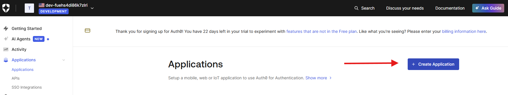
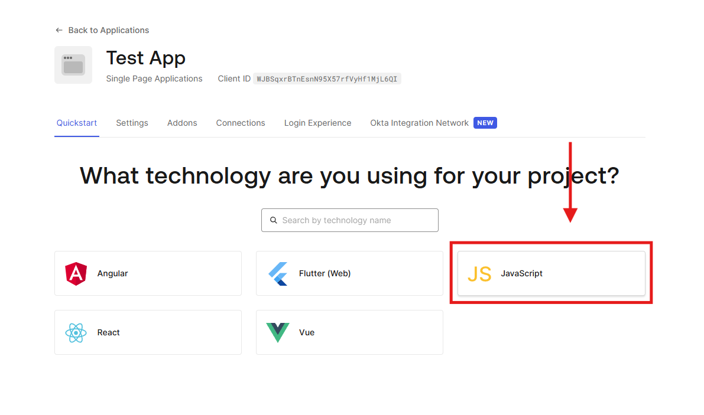
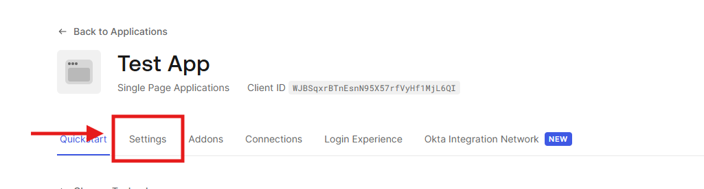
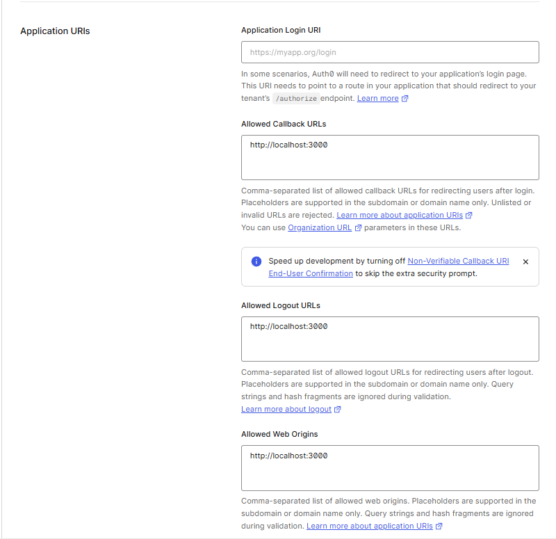
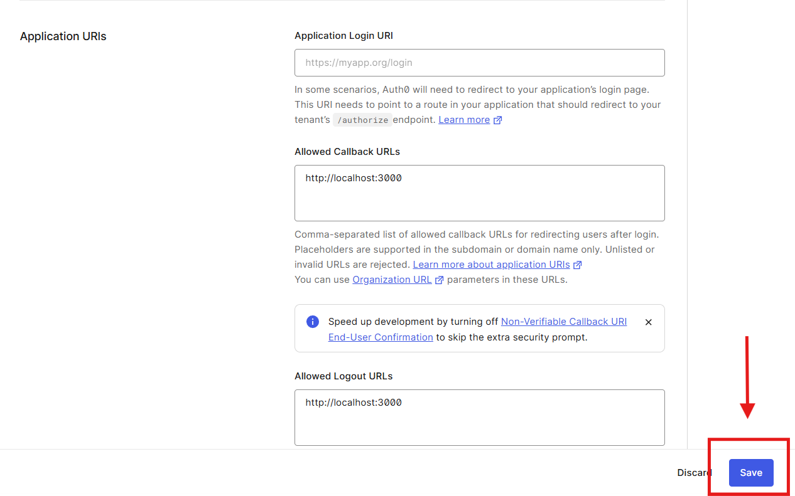

# Auth0 SPA Login Demo

Este proyecto es una demostración mínima de cómo integrar **Auth0** en una Single Page Application usando **auth0-spa-js**.
El objetivo es mostrar el flujo de login, logout y obtención del perfil del usuario con el menor código posible.

---

## 🚀 Tecnologías utilizadas

* HTML + JavaScript (sin frameworks)
* Auth0 SPA JS SDK (`auth0-spa-js`)
* Servidor estático (`npm lite-server`)

---

## 📦 Estructura del proyecto

```
Auth0Demo/
│── index.html
│── README.md
```

El archivo **index.html** contiene toda la lógica de autenticación.

---

## 🛠 Requisitos previos

Antes de ejecutar el proyecto, necesitás:

1. Una cuenta de **Auth0**
2. Crear una **Single Page Application** en Auth0
3. Obtener:

   * **Domain**
   * **Client ID**

### Ejemplo de dónde obtener estos valores:








---

## ⚙️ Configuración de Auth0

Dentro de **Applications → Your App → Settings**, agregá las siguientes URLs:

### **Allowed Callback URLs**

```
http://localhost:3000
```

### **Allowed Logout URLs**

```
http://localhost:3000
```

### **Allowed Web Origins**

```
http://localhost:3000
```


Luego copiá el **Domain** y el **Client ID** dentro del código del proyecto:

```js
const auth0Client = await auth0.createAuth0Client({
  domain: "<YOUR_DOMAIN>",
  clientId: "<YOUR_CLIENT_ID>",
  authorizationParams: {
    redirect_uri: window.location.origin
  }
});
```

---

## ▶️ Cómo correr el demo

1. Cloná el repositorio:

```bash
git clone https://github.com/<tu-usuario>/<tu-repo>.git
cd <tu-repo>
```

2. Instalá las dependencias del proyecto:

```bash
npm install
```

3. Ejecutá el servidor local:

```bash
npm start
```

4. Abrí el navegador en:

```
http://localhost:3000
```

---

## 🧪 Uso

* **Log In** → Abre el Universal Login de Auth0.
* **Log Out** → Cierra sesión en Auth0 y vuelve a la app.

Después del login, se muestra el **perfil del usuario**:

```json
{
  "name": "example@gmail.com",
  "nickname": "example",
  "picture": "https://...",
  "sub": "auth0|xxxx"
}
```


---

## 📄 Notas importantes

* Este proyecto no requiere framework ni backend.
* El flujo utilizado es **Authorization Code Flow con PKCE**.
